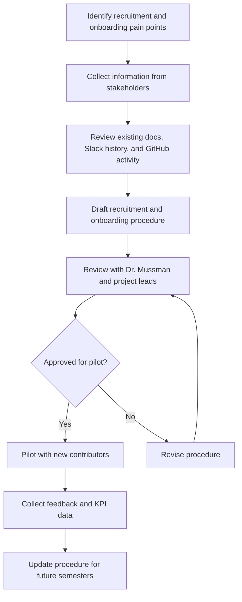
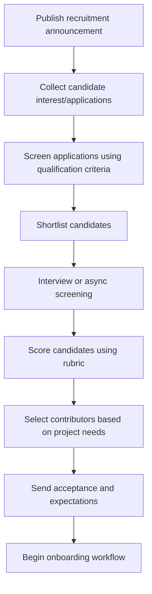
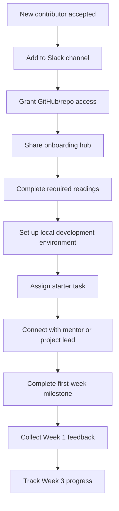

# Management & Leadership Mid-Semester Report

**Name:** Kiran Patil  
**Email:** kpatil42@gatech.edu
**Topic Area:** Recruitment — Vector DB Project (HAAG)  
**Initiative Title:** Standardized Recruitment and Onboarding Procedure for Vector DB Project Contributors  

---

## Initiative Questions

### 1. Describe your initiative/procedure.

My initiative focuses on creating a standardized recruitment, selection, and onboarding procedure for the Vector DB Project within HAAG. The purpose of this initiative is to reduce ambiguity in how new contributors are recruited each semester and to make the onboarding process more consistent, repeatable, and transparent.

Currently, recruitment and onboarding can depend heavily on informal knowledge from project leads or experienced contributors. This creates risks such as inconsistent candidate evaluation, repeated onboarding questions, delayed access setup, and loss of institutional knowledge when members rotate out. My procedure addresses this by consolidating project scope, expectations, required skills, tooling, communication norms, and onboarding steps into a reusable recruitment and onboarding framework.

The procedure is intended to support the full recruitment lifecycle:

1. Publishing a clear recruitment announcement.
2. Collecting candidate interest and applications.
3. Evaluating candidates using consistent criteria.
4. Selecting contributors based on project needs and candidate fit.
5. Onboarding selected contributors through documented setup steps, starter tasks, mentorship support, and early milestones.

The long-term goal is to make this procedure reusable across semesters and potentially adaptable for other HAAG projects.

---

### 2. Explain the hypotheses/KPIs you have measured at this time and what is left to be measured.

The primary hypothesis is that a standardized recruitment and onboarding procedure will improve consistency, reduce onboarding friction, and help new contributors become productive faster.

#### Hypotheses

| Hypothesis | Current Status | Notes |
|---|---|---|
| A centralized recruitment/onboarding hub will reduce repeated questions from new contributors. | Partially measured | Early review of onboarding pain points suggests repeated questions often come from unclear documentation or scattered information. |
| A standardized evaluation rubric will improve fairness and consistency in candidate selection. | In progress | Rubric criteria have been drafted but still need validation from project leadership. |
| A structured onboarding checklist will reduce setup delays. | In progress | Initial checklist categories have been identified, including Slack, GitHub, repo setup, readings, and starter tasks. |
| First-week milestones will improve early engagement and accountability. | Not yet measured | This requires piloting with new contributors. |
| The procedure will preserve institutional knowledge across semesters. | Not yet measured | This will be evaluated after the procedure is hosted and reused. |

#### KPIs Being Considered

| KPI | Purpose |
|---|---|
| Time-to-first-PR or first meaningful contribution | Measures new contributor ramp-up speed | Not yet measured |
| Number of repeated onboarding questions in Slack | Measures clarity of documentation | Partially measured through observation |
| Number of access/setup blockers | Measures effectiveness of onboarding checklist | Not yet measured |
| Candidate evaluation consistency | Measures usefulness of rubric | In progress |
| New member confidence after Week 1 and Week 3 | Measures onboarding quality | Not yet measured |
| Stakeholder approval of procedure | Measures correctness and usefulness | In progress |

At this stage, most of the work has focused on defining the procedure, identifying stakeholders, and determining what information should be collected. The next phase will focus on validating the procedure with Dr. Mussman, current project leads, and a small pilot group of contributors.

---

### 3. Explain your method for testing these hypotheses via flowcharts.

The testing method follows an observe-document-pilot-measure-improve cycle. First, I collect information from existing documentation, Slack discussions, GitHub activity, and stakeholder interviews. Then I draft the recruitment and onboarding procedure. After review by project leadership, the procedure can be piloted with new recruits. Finally, feedback and KPI data will be used to revise the process.

#### Flowchart 2: Recruitment Cycle

#### Flowchart 3: Onboarding Workflow

---

### 4. Explain how stakeholders are engaging with your initiative. Reflect on whether their engagement matches your expectations and what changes may be necessary given the behavior that you observed.

The key stakeholders for this initiative include Dr. Mussman, current project leads, senior contributors, mentors, prospective recruits, and newly onboarded contributors. Their engagement is expected to come in different forms depending on their role.

Dr. Mussman and project leads are expected to provide direction on recruitment goals, candidate capacity, expectations, and final approval of the procedure. Senior contributors are expected to provide practical feedback about onboarding challenges, tool setup, and common questions. New contributors are expected to help validate whether the onboarding materials are clear and actionable.

So far, the expected engagement pattern is that project leadership will be most useful during procedure validation, while contributors will be most useful during the feedback and pilot phases. This matches my expectations because recruitment and onboarding decisions require leadership input, but the quality of onboarding is best tested with actual users of the procedure.

One possible change may be needed in how feedback is collected. If stakeholders are busy or slow to respond, I may need to use short asynchronous surveys instead of longer interviews. This would make it easier for contributors and leads to provide targeted feedback without requiring a meeting. Another change may be to use Slack threads or pinned posts as lightweight documentation modules rather than relying only on one long document.

---

### 5. What processes have you documented or begun documenting to ensure the sustainability of your initiative? Provide where you are hosting this procedure. What additional documentation do you plan to complete? Link documents here for review.

I have begun documenting the core recruitment and onboarding procedure in markdown format so that it can be hosted in the project GitHub repository. Hosting the procedure in GitHub makes it easier to version, review, update, and reuse across semesters.

#### Documentation Started

| Document | Purpose |
|---|---|
| Recruitment and Onboarding Hub | Central page containing scope, expectations, links, and onboarding checklist |
| Candidate Qualification Criteria | Defines required and preferred skills, availability, and communication expectations |
| Evaluation Rubric | Provides consistent scoring criteria for applications/interviews |
| Onboarding Checklist | Step-by-step checklist for new contributors |
| First-Week Milestones | Defines early tasks and expectations for new members |

#### Planned Hosting Location

The procedure will be hosted in the Vector DB Project GitHub repository.

### 6. How are you currently measuring progress toward your goals? What indicators of success or challenges have you identified so far?

Progress is currently being measured through completion of documentation artifacts, stakeholder feedback, and identification of measurable onboarding outcomes. I am also using a tracking spreadsheet to organize progress, document open items, and monitor the recruitment and onboarding procedure.

**Tracking Spreadsheet:** [Recruitment Procedure Progress Tracker](https://gtvault-my.sharepoint.com/:x:/g/personal/dbona3_gatech_edu/IQBguo5ypfiQRYzWQwi0cfNDAQRcV02K-1EYpyRJvRzK3RA?e=SpSLyB)

#### Current Progress Measures

| Goal | Measurement Approach |
|---|---|
| Create centralized onboarding documentation | Track completion of GitHub markdown documents and progress tracker updates |
| Define candidate selection criteria | Review drafted criteria with leadership and record feedback in tracker |
| Reduce onboarding ambiguity | Identify repeated questions and blockers from Slack/history |
| Improve early contributor productivity | Plan to measure time-to-first-task or PR |
| Improve sustainability | Host procedure in GitHub for reuse and track documentation ownership |

#### Early Indicators of Success

Early indicators of success include having a clear structure for recruitment, a draft set of qualification criteria, and a repeatable onboarding workflow. The initiative is also creating a common vocabulary for project leadership to discuss candidate fit, onboarding readiness, and contributor expectations.

#### Early Indicators of Challenge
The main challenge is that some of the most useful information may exist informally in Slack conversations or in the experience of current contributors rather than in formal documentation. Another challenge is that the procedure must remain lightweight. If it becomes too detailed or difficult to maintain, future project leads may not use it consistently.

---

### 7. What obstacles or bottlenecks have you encountered in implementing your initiative? Which anticipated challenges have materialized, and what unexpected issues have arisen?

One anticipated challenge is the availability of stakeholders. Project leads and senior contributors may have limited time to provide feedback, which could slow down validation of the procedure. To address this, I plan to use concise review requests and targeted questions rather than asking stakeholders to review large documents all at once.

Another challenge is balancing standardization with flexibility. Recruitment needs may change each semester depending on project goals, open tasks, technical needs, and contributor capacity. The procedure must provide enough structure to be useful without becoming too rigid.

A third bottleneck is identifying accurate historical onboarding pain points. Some problems may not be visible unless contributors explicitly mention them. For example, access delays, unclear setup steps, or confusion about starter tasks may not always be documented. This means interviews and feedback forms will be important.