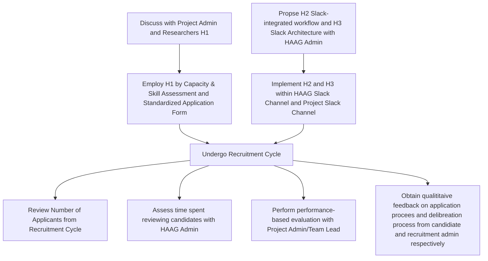

# Management & Leadership Final Report

## Initiative

- Project Context: Vector DB Research Project (Dr. Mussman)
- Initiative Manager: Dylan Bona
- dbona3@gatech.edu
---

## Define Scope of Intiative

My inititiave revolves around a modular, Slack-Integrated Recruitment Operations Framework (ROF) paired with (4) Standardized Operating Procedures/Processes (SOP) to regulate recruitment, evaluation, and onboarding processes within all HAAG research projects. The overall goal is for the framework and SOPs to adddress the current inefficiencies with research recruitment which includes

- Unclear role/candidate expectations
- Inconsistent onboarding experiences
- Non-uniform recruitment and deliberation communication
- Lack of persistent recruitment and project documentation

---

## Alignment with HAAG's Goals

Stakeholders for my inititiative project as a whole, for example Bree, as well as the other managers within the Management & Leadership cohort have shown positive reception to a recruitment framework that revolves around Slack. It aligns with the current HAAG initiative to consolidate operational technology with HAAG research projects to the preferred method of Slack, while also addressing the recurring theme that legacy recruitment processes are not being followed semester over semester. With the aim to create a concise yet highly detailed set of Standard Operating Procedures/Processes, the stakeholders of the HAAG Recruitment Admin team should benefit from a standardized recruitment workflow, the stakeholders in the research team will realize smoother onboarding and eventual research contributions, and the candidate researchers themselves will experience efficient placement and project alignment when applying to projects. Therefore mentioned is still contingent on gathering the necessary background and further detail of previous recruitment operations and processes from the current HAAG admin team to ensure common pitfalls and repeated work is avoided or altered.

---

## Testing Workflow:

---

## SlackROF Procedures

The (4) Standardized Operating Procedures/Processes (SOP) are listed below with their expected outputs:

Procedure 1.1 – [Capacity & Skill Gap Assessment](SlackROF/Capacity_Skill_Gap_Assessment.md)

- Identify number of recruits needed
- Define required technical skills
- Define expected weekly commitment
- Define deliverable expectations

Output: Published Role Description

Procedure 2.1 – [Standardized Application Form](SlackROF/Standardized_Application_Form.md)

Implements a Slack Workflow-based application system collecting:

- Academic background
- Relevant coursework
- Technical stack
- Availability
- Prior research experience
- Motivation statement

Applications submitted via: Slack Workflow Form
- Deliberation occurs in a determined private Slack Channel

Output: Structured applicant dataset reviewed in private Slack channels

Procedure 3.1 – [Onboarding Packet](SlackROF/Onboarding_Packet.md)

Includes:
- Project Overview
- Git Workflow/Access
- Documentation standards
- Operational Expectations
- Current Team Profile

Output: Consistent Onboarding Experience

Procedure 4.1 – [Slack Recruitment Architecture](SlackROF/Slack_Recruitment_Architecture.md)

Procedure/Process for HAAG Admin/Recruitment Team to reconfigure both overall HAAG Slack Channel and Project Channels to include the following skelection, using Vector DB as the specific project example:

Public Channels
- #vectordb-general
  - High level overview of Vector DB project through Slack Canvas
- #vectordb-recruitment
  - Standardized Application Form using Slack Workflow Form

Private Channels
- #vectordb-recruitment-review
  - Dedicated private slack channel for admins to review submitted forms
- #vectordb-onboarding
  - Channel where new recuits are provided Onboarding Packet
- #vectordb-admin
  - Private discussion channel for Project Recruitment Admin

Output: Uniform recruitment and internal deliberation channels

---

