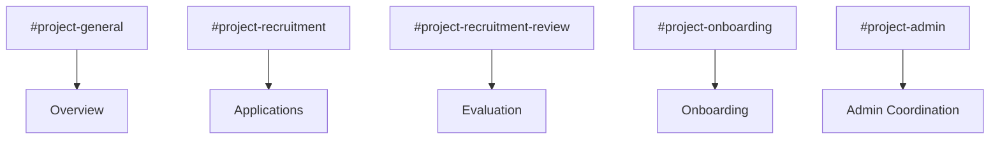

# SOP 4.1 – Slack Recruitment Architecture

## Overview
This procedure defines the standardized Slack channel structure used to manage recruitment, evaluation, onboarding, and admin communication.

---

## Purpose
Ensure organized, transparent, and scalable recruitment workflows within Slack.

---

## Intended Audience
- HAAG Admin Team  
- Project Managers  

---

## Architecture Diagram

---

## When to Use
- At project setup  
- Before each recruitment cycle  

---

## Procedure

### 1. Create Public Channels
- `#project-general`
  - Project overview (Slack Canvas)  

- `#project-recruitment`
  - Role descriptions  
  - Application form  

---

### 2. Create Private Channels
- `#project-recruitment-review`
  - Candidate evaluation  

- `#project-onboarding`
  - New recruit onboarding  

- `#project-admin`
  - Internal admin coordination  

---

### 3. Configure Permissions
- Public channels → all HAAG members  
- Private channels → restricted access  

---

### 4. Define Channel Usage
- Recruitment → recruitment channel only  
- Evaluation → review channel only  
- Onboarding → onboarding channel only  

---

### 5. Maintain Channel Discipline
- Redirect misplaced discussions  
- Prevent recruitment decisions in general channels  

---

## Output
- Organized Slack workspace  

---

## Success Criteria
- Clear communication structure  
- Reduced clutter and confusion  

---

## Enforcement
- All recruitment activity must occur in designated channels  
- HAAG Admin enforces channel usage  

---
