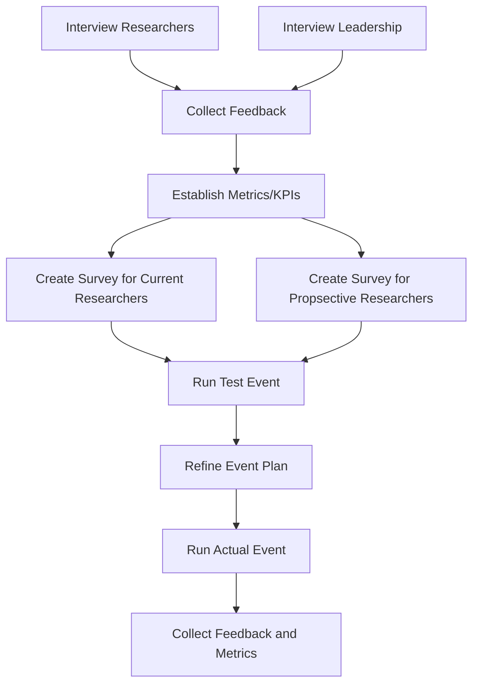

# Management & Leadership Final Report
(Initiative Portion, Subhash Gubba)

## Initiative Overview
My initiative is to hold a HAAG Open House hosted live via a Teams event/webinar and recorded and posted for those who could not attend to watch later. The purpose of this is to help with **researcher** recruitment to the program, and to increase the interest and reduce the confusion which may be surrounding what HAAG projects are all about.
The initiative encompasses the following:
- Surveying newly joined researchers about their interest and their understanding of the HAAG organization.
- Planning the Open House event.
- Executing the Open House event.
- Surveying prospective researchers about the event, their interest, and their understanding of the HAAG organization.
- Wrapping up the initiative by uploading recordings of the event and sending them out along with the above survey.

Planning the open house, drafting the emails, and sending the surveys involves close coordination with HAAG leadership and Open House volunteers (usually 1 representative from each research project). It is recommended that 1 or 2 HAAG managers or admins champion this activity, and that they start working on it right before the middle of the semester to allow ample time.

## Evidence for Value of the Open House
### Interviews with Managers, Admins, and Researchers
When talking to various HAAG participants, common concerns were voiced about:
- Lack of clarity when entering the organization
- Not having enough information during the selection / application process
- Unsure who to ask questions about projects and the organization itself

### Interviews with HAAG Leadership
HAAG Leadership conversations revealed:
- The Open House / End of Semester showcase historically happened but grew to become cumbersome to plan and execute
- The event was valuable and provided an opportunity to bring the community together and recognize achievements
- There is a need to increase recruitment of researchers and interest in HAAG

### Observations
The website and Wikis can be hard to navigate and get information from, especially as a newcomer or prospective member. The application and matching process in HAAG is also not fully understood by most, and the primary source of information most people used to understand the projects was the project description word doc and adverts.

## Explain the hypotheses / KPIs you have measured at this time and what is left to be measured.
### H1 - This would be desirable, allowed, and practical for HAAG leadership.
*Affirmed.* As talking with multiple managers, admins, and HAAG leadership this was an event done previously in some form and was found to be valuable. It just became very cumbersone with the amount of projects growing.
### H2 - Researchers want to and are able to attend a live meeting or access the VOD later.
*Affirmed.* Clarity around the projects and a forum to easily ask questions seems to be missing for prospective researchers. This was mentioned at least within conversations with managers and admins when reflecting on when they joined.
### KPI 1 - Attendance/Viewer Count
*Pending.* How many people are attending and viewing the Open House / Project Showcase? Is it reaching the desired number of people and the intended audience?
### KPI 2 - Satisfaction/Confidence Score for event attendees
*Pending.* Did people get what they were seeking from the Open House? Are they understanding what we are conveying to them? This can be measure using questions in a survey and a scale from 1 to 10 for a score.
### KPI 3 - HAAG Application Count
*Pending.* How many people are applying to be a HAAG researcher? Is that count increasing, and can it be traced to the Open House in some way?

## Explain your method for testing these hypotheses via flowcharts:
Testing hypotheses and measuing KPIs can follow this flow:

## Explain how stakeholders are engaging with your initiative.
So far other managers and HAAG admins/leadership have reacted to the idea with enthusiasm as well as caution. Since the open house is something that had been attempted in the past when HAAG was smaller, it has some history. I am excited that there is both a need and a desire for something like this, and I think that researchers have a lot of questions and confusion coming into HAAG that can be cleared up effectively with an event like this. The need for it to be asynchronous is also apparent, and there's no reason it can't be both.

## Process Documentation Progress:
I have a procedure for an admin/manager to drive the Open House documented here:
https://github.com/Human-Augment-Analytics/Admin-Recruitment-Unit/blob/main/Open-House/proc-plan-and-execute.md

The procedure will remain there in the github repo for recruitment and can be referenced by future HAAG Open House coordinators to ensure the tradition lives on.

Part of the that procedure will be to include templates for surveys which can be used to collect more information from researchers and potential researchers, which I will work on over the next couple weeks.

## Indicators of Progress, Success/Challenges, and Goals
### Goals
1. **Find a project representative per team (maybe start with managers)**
    - **Success** looks like having a list of people committed to participating in the Open House
    - **Status**: In Progress, messaging people
    - **Challenge**: Might be difficult to assemble another group of people, already so many groups which are demanding everyone's time
2. **Finish procedures and surveys for the event**
    - **Success** looks like having three procedures, one for planning and running the open house, one for creating and sending feedback surveys, and one for posting the event online and circulating it.
    - **Status**: In Progress, drafting procedure documents
3. **Set a date for the Open House/Project Showcase**
    - **Success** looks like having a set date (or two if necessary) to run the live event
    - **Status**: TO DO
    - **Challenge**: Hard to find a date that will work for everyone. Might need to just set one and the work backwards. Need to give everyone notice.
4. **Get the project representatives on the same page for the event**
    - **Success** looks like having a slack channel for coordinating the event and DM'ing and checking in with reps about their contributions for the event
    - **Status**: TO DO
    - **Challenge**: Coordinating a large group and making sure everyone understands the expectations can be difficult.
5. **Spread the word about the Open House event**
    - **Success** looks like having a emails sent to newsletter and email lists advertising the event for prospective researchers to join
    - **Status**: TO DO
    - **Challenge**: Emails and word of mouth may not actually be enough to plug the event.
6. **Execute the event, record and post online**
    - **Success** looks like hosting the event, having good attendance, and posting it online for those who could not join the live event to view later.
    - **Status**: TO DO
7. **Monitor survey results and publish / share with HAAG leadership**
    - **Success** looks like sharing the results of surveys with leadership so they can review it and make informed decisions for the future.
    - **Status**: TO DO
    - **Challenge**: Might be challenging to hand-off results and ensure they are utilized by busy leadership.

## Obstactles, Bottlenecks and Challenges:
No real challenges yet, but I anticipate it might be tough to find ample time from people, especially leadership, to review procedures and plans.
