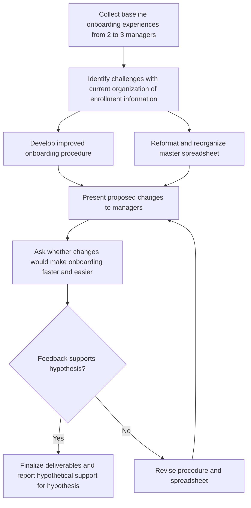

# Midterm Semester Report: Initiative

> **Alexa Accuardi** _(Animal Detection)_

#### Describe your initiative/ Procedure.

The purpose of this initiative is to improve the process of onboarding for managers by improving how information related to active enrollments within HAAG is organized. The deliverable will be a procedure that outlines the process for getting organized at the start of each semester and a newly formatted master excel spreadsheet.

#### Explain the hypotheses/ KPIs you have measured at this time and what is left to be measured.

My hypothesis is that creating a procedure and reorganizing the master spreadsheet will improve the speed at which managers onboard each semester. This hypothesis will need to be measured hypothetically since another manager onboarding cycle will not occur until a future semester.

#### Explain your method for testing these hypotheses via flowcharts:

#### Explain how stakeholders are engaging with your initiative. Reflect on whether their engagement matches your expectations and what changes may be necessary given the behavior that you observed.

So far, my main interactions related to this initiative have been iterating on the proposal with feedback from the HAAG staff and my peers. My initial proposal was vague, too broad, and failed to outline concrete success metrics. I also focused heavily on adopting Notion as a project management tool without first understanding the core problem.

In order to scope my project down, I am now focused solely on the manager persona. I also decided to remove mention of Notion from my project in favor of utilizing tools already available to HAAG. If those tools fail to meet the needs of my project, I will then begin to consider alternatives.

#### What processes have you documented or begun documenting to ensure the sustainability of your initiative provide where you are hosting this procedure? What additional documentation do you plan to complete? Link documents here for review.

- [Initiative Proposal Feedback](https://gtvault-my.sharepoint.com/:w:/g/personal/aaccuardi3_gatech_edu/IQAxgzwEacnrRqbyUibccr5uAWLTifUS-RFjRdyH664vLAs?e=mbrqy8)
- [Interview Questions](https://github.com/Human-Augment-Analytics/Admin-Recruitment-Unit/blob/main/Manager-Onboarding/interview-questions.md)
- [Procedure](https://github.com/Human-Augment-Analytics/Admin-Recruitment-Unit/blob/main/Manager-Onboarding/manager-onboarding-procedure.md) (currently blank, will complete this at a later time)
- I will also create a new version of the master spreadsheet

#### How are you currently measuring progress toward your goals? What indicators of success or challenges have you identified so far?

The only progress made at this time has been refining the project and developing the interview questions. As I continue with this project, I will measure progress using the flowchart above. A primary indicator of success will be creating a new procedure and spreadsheet that resonate with my peers. Any challenges that I encounter I will bring up with my recruitment initiative cohort or in the manager weekly syncs.

#### What obstacles or bottlenecks have you encountered in implementing your initiative? Which anticipated challenges have materialized, and what unexpected issues have arisen?

The biggest challenge so far has been deciding what to do for this project. I think now that I have narrowed the scope and targeted the rest will hopefully be more straightforward. I was not familiar with HAAG at all prior to this term so a lot of time has been spent understanding the norms and needs within the group.
